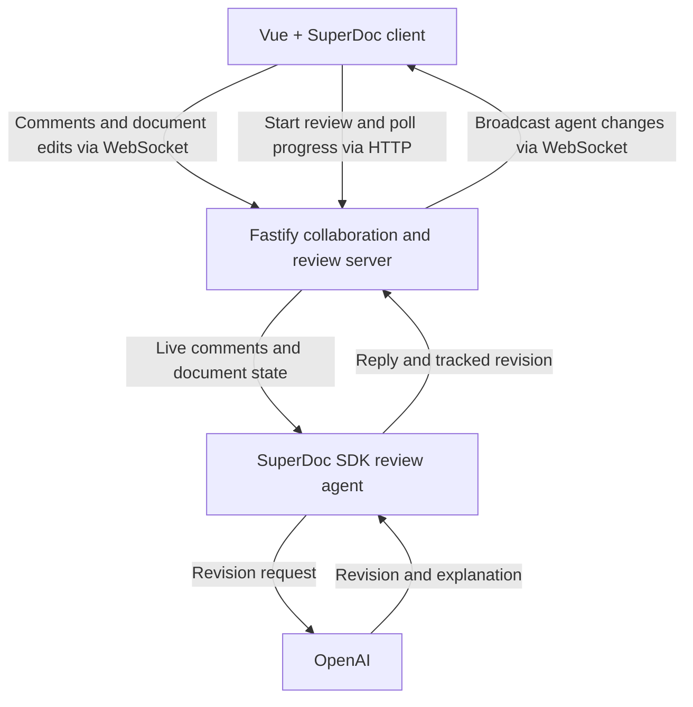

# SuperDoc Comment Review Agent

A local demo of a user and AI agent reviewing a document together.

The user comments on selected text. The agent reads the comment, replies in the same thread, and applies its revision as a tracked change.

## Architecture



## Requirements

- Node.js 20 or newer
- An OpenAI API key

## First-time setup

From the project directory, install all dependencies:

```bash
npm run install:all
```

Create your local environment file:

```bash
cp .env.example .env
```

Open `.env` and replace the example value with your OpenAI API key:

```env
OPENAI_API_KEY=sk-your-key-here
```

## Run the demo

```bash
npm run dev
```

Then open:

**http://localhost:5173**

The command starts both the Vue client and the local collaboration/review server. The server runs on `http://localhost:3050`.

## Try it

1. Select text in the document.
2. Add a comment describing the change you want.
3. Wait for the agent to review the new comment automatically.
4. Review the agent's reply and tracked revision.

Use **Request Review** to process existing open comments. Use **Import** to load a DOCX file or **Blank document** to start fresh.

Stop the demo with `Ctrl+C`.

## Troubleshooting

- If the backend is unavailable, confirm both processes started and ports `3050` and `5173` are free.
- If agent review fails, confirm `OPENAI_API_KEY` is set correctly in `.env`.
- After changing `.env`, stop and restart `npm run dev`.
